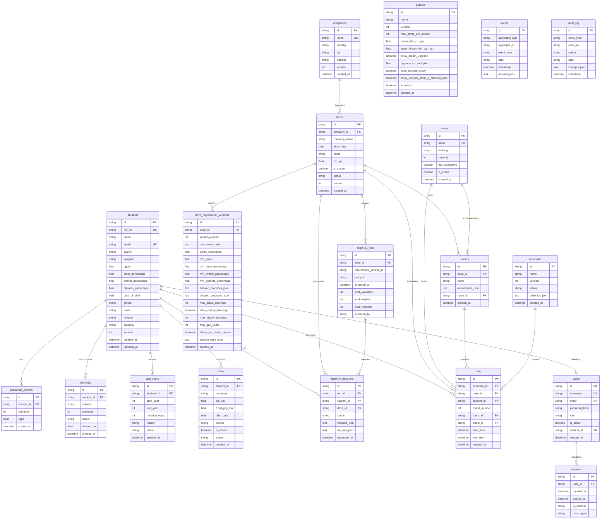

# Entity Relationship Diagram (ERD)

The diagram below documents the database schema and relational constraints implemented in the Placement Engine.

```mermaid
erDiagram
    students ||--o{ academic_records : "has"
    students ||--o{ backlogs : "accumulates"
    students ||--o{ gap_years : "records"
    students ||--o{ offers : "receives"
    students ||--o{ eligibility_decisions : "evaluated_in"
    students ||--o{ slots : "assigned"
    students ||--o| users : "linked_to"

    companies ||--o{ drives : "sponsors"

    drives ||--o{ drive_requirement_versions : "versions"
    drives ||--o{ panels : "hosts"
    drives ||--o{ eligibility_runs : "triggers"
    drives ||--o{ eligibility_decisions : "generates"
    drives ||--o{ slots : "schedules"

    eligibility_runs ||--o{ eligibility_decisions : "contains"

    rooms ||--o{ panels : "accommodates"
    rooms ||--o{ slots : "hosts"

    panels ||--o{ slots : "conducts"

    schedules ||--o{ slots : "contains"

    users ||--o{ sessions : "maintains"

    students {
        string id PK
        string roll_no UK
        string name
        string email UK
        string branch
        string program
        float cgpa
        float tenth_percentage
        float twelfth_percentage
        float diploma_percentage
        date date_of_birth
        string gender
        string caste
        string religion
        string category
        int version
        datetime created_at
        datetime updated_at
    }

    academic_records {
        string id PK
        string student_id FK
        int semester
        float sgpa
        datetime created_at
    }

    backlogs {
        string id PK
        string student_id FK
        string subject
        int semester
        string status
        date cleared_on
        datetime created_at
    }

    gap_years {
        string id PK
        string student_id FK
        int start_year
        int end_year
        int duration_years
        string reason
        string phase
        datetime created_at
    }

    offers {
        string id PK
        string student_id FK
        string company
        float ctc_lpa
        float fixed_pay_lpa
        date offer_date
        string source
        boolean is_dream
        string status
        datetime created_at
    }

    companies {
        string id PK
        string name UK
        string industry
        string tier
        string website
        int version
        datetime created_at
    }

    drives {
        string id PK
        string company_id FK
        string company_name
        date drive_date
        string mode
        float ctc_lpa
        boolean is_dream
        string status
        int version
        datetime created_at
    }

    drive_requirement_versions {
        string id PK
        string drive_id FK
        int version_number
        text raw_source_text
        float parse_confidence
        float min_cgpa
        float min_tenth_percentage
        float min_twelfth_percentage
        float min_diploma_percentage
        text allowed_branches_json
        text allowed_programs_json
        int max_active_backlogs
        boolean allow_history_backlogs
        int max_history_backlogs
        int max_gap_years
        boolean allow_gap_during_degree
        text custom_rules_json
        datetime created_at
    }

    policies {
        string id PK
        string name
        int version
        int max_offers_per_student
        float dream_tier_ctc_lpa
        float super_dream_tier_ctc_lpa
        boolean allow_dream_upgrade
        float upgrade_ctc_multiplier
        boolean strict_backlog_cutoff
        boolean allow_multiple_offers_if_different_tiers
        boolean is_active
        datetime created_at
    }

    eligibility_runs {
        string id PK
        string drive_id FK
        string requirement_version_id
        string policy_id
        datetime executed_at
        int total_evaluated
        int total_eligible
        int total_ineligible
        string executed_by
    }

    eligibility_decisions {
        string id PK
        string run_id FK
        string student_id FK
        string drive_id FK
        string status
        text reasons_json
        text rule_ids_json
        datetime evaluated_at
    }

    rooms {
        string id PK
        string name UK
        string building
        int capacity
        boolean has_computers
        boolean is_active
        datetime created_at
    }

    panels {
        string id PK
        string drive_id FK
        string name
        text interviewers_json
        string room_id FK
        datetime created_at
    }

    schedules {
        string id PK
        string name
        int version
        string status
        text drive_ids_json
        datetime created_at
    }

    slots {
        string id PK
        string schedule_id FK
        string drive_id FK
        string student_id FK
        int round_number
        string room_id FK
        string panel_id FK
        datetime start_time
        datetime end_time
        datetime created_at
    }

    events {
        string id PK
        string aggregate_type
        string aggregate_id
        string event_type
        string actor
        datetime timestamp
        text payload_json
    }

    audit_log {
        string id PK
        string entity_type
        string entity_id
        string action
        string actor
        text changes_json
        datetime timestamp
    }

    users {
        string id PK
        string username UK
        string email UK
        string password_hash
        string role
        boolean is_active
        string student_id FK
        datetime created_at
    }

    sessions {
        string id PK
        string user_id FK
        datetime created_at
        datetime expires_at
        string ip_address
        string user_agent
    }
```
